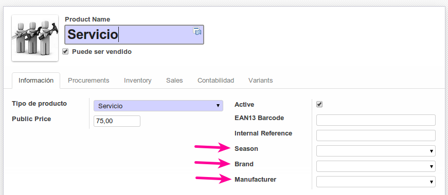
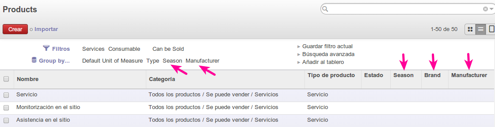

[](http://drone.trey.es/git.trey.es/odoo/product_season)


Información
===========

***Rama actual master***

Compatibilidad
 * Para OpenERP v6.1 (OCB), rama 6.1
 * Para Odoo v8.0, rama master


Añade los siguientes campos a la información del producto:
 * Fabricante
 * Temporada
 * Marca

Modifica la ficha del producto para añadir los campos, además modifica el listado de productos para añadir los campos de busqueda y de agrupación.






Instalación
===========

Para instalar la rama 6.1, descarga la rama principal (master) y cambia de rama
```
git clone git@git.trey.es:odoo/product_season.git
cd product_season
git checkout 6.1
```
Si revisa el README.md al principio del documento aparece la rama a la que pertenece
